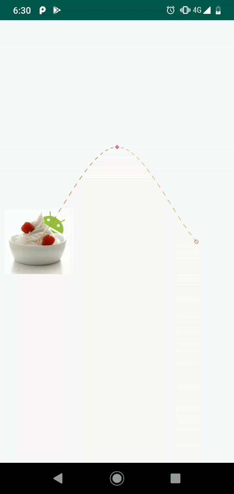
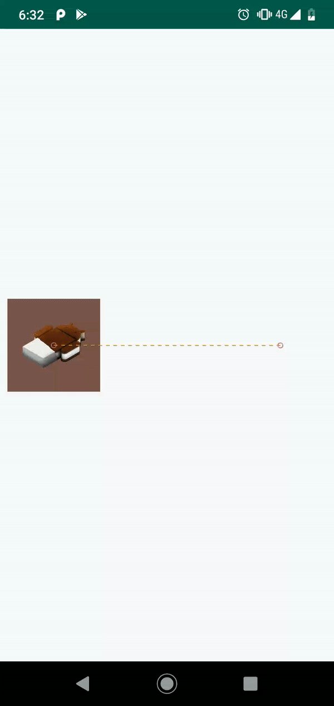
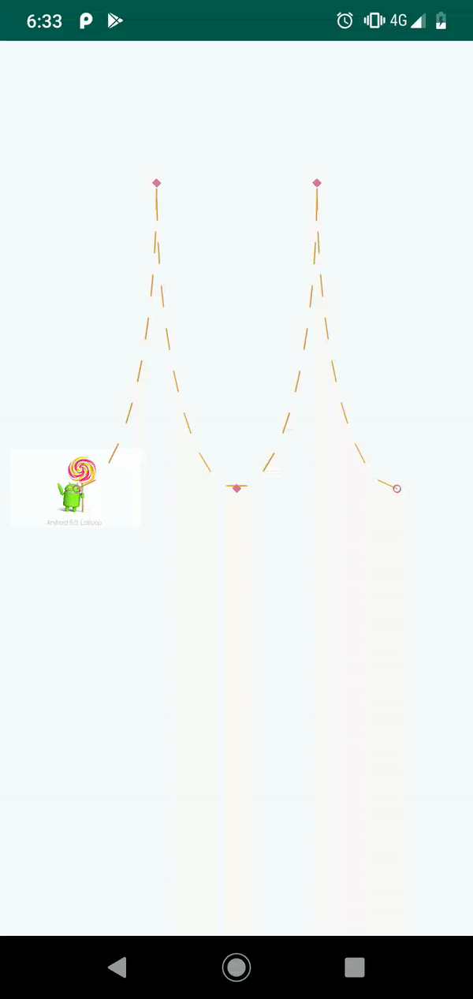
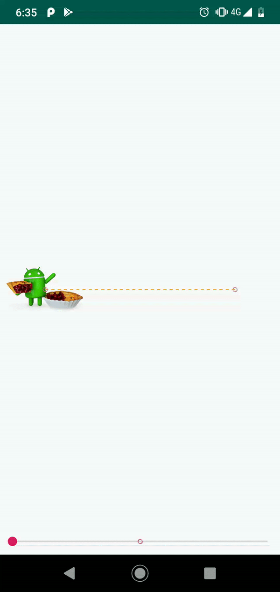
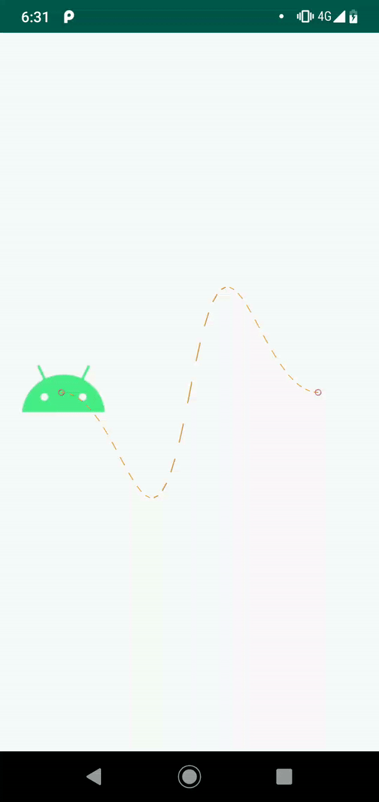
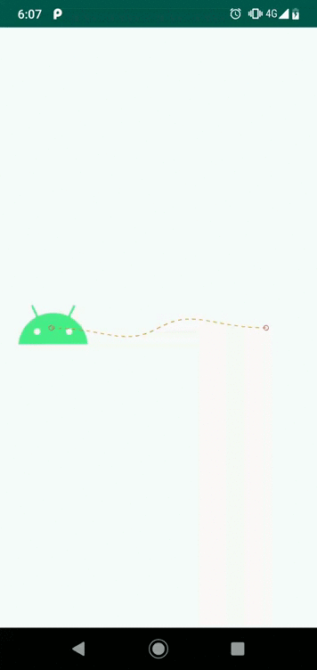
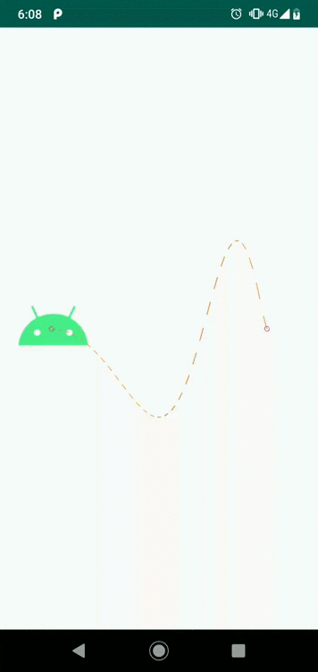
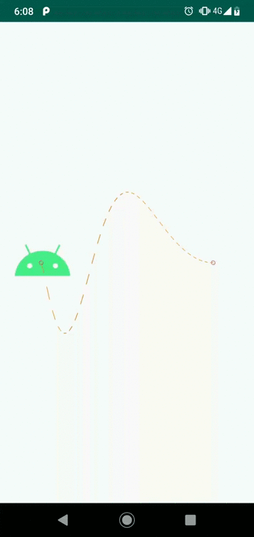
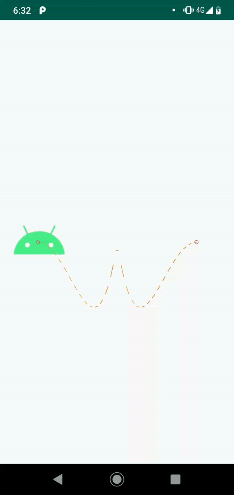
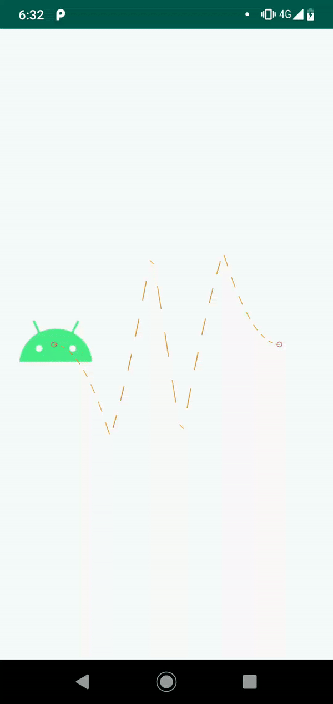

# motion-layout-playground
Android project to play with Motion Layout.

[Medium article that describes first examples.](https://medium.com/xebia-france/move-my-app-with-motionlayout-part-1-7800637feb22)

[Medium article that describes complex examples.](https://medium.com/xebia-france/move-my-app-with-motionlayout-part-2-12427f74bdaa)

Each step will introduce a new topic about motion layout :

Basic with a change on a constraint

Change on the size

Add keyframe to create a curve

Add keyframe with change on size

Add keyframe with change on rotation

Change on the background color

Change on the image

Change on the image saturation

Complex path during the motion

Connecting with a coordinator layout

Connecting with a view pager

Connecting with a drawer

Connecting with a seekbar

KeyCycle 1

KeyCycle 1b

KeyCycle 1c

KeyCycle 1d

KeyCycle 2

KeyCycle 3

KeyCycle 4

