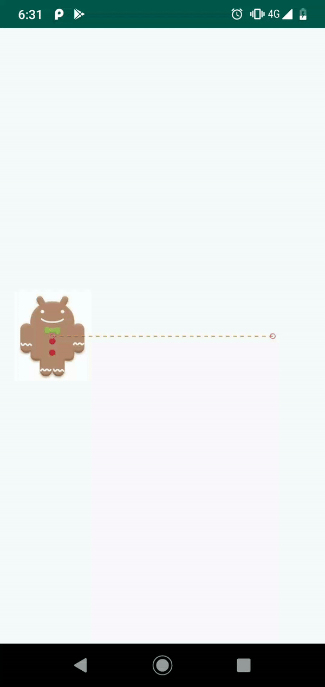
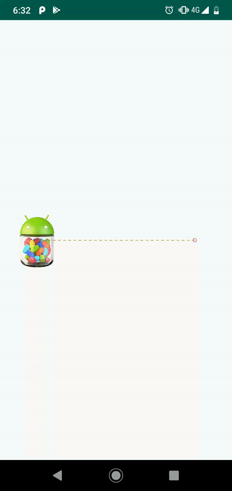
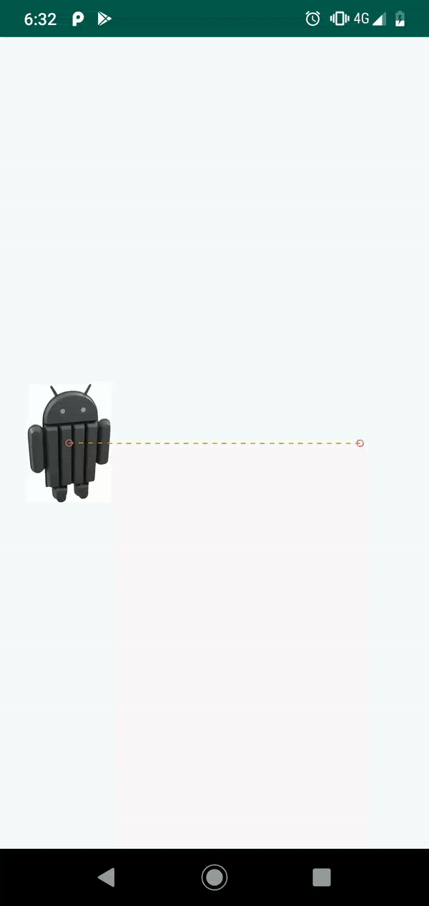
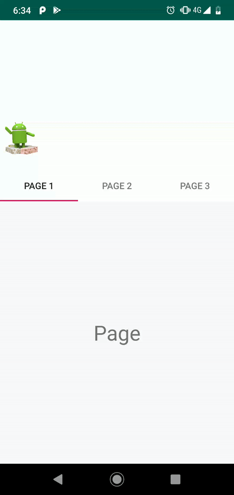

# motion-layout-playground
Android project to play with Motion Layout.

Each step will introduce a new topic about motion layout :

Basic with a change on a constraint

Change on the size

Add keyframe to create a curve

Add keyframe with change on size

Add keyframe with change on rotation

Change on the background color

Change on the image

Change on the image saturation

Complex path during the motion

Connecting with a coordinator layout

Connecting with a view pager

Connecting with a drawer

Connecting with a seekbar

