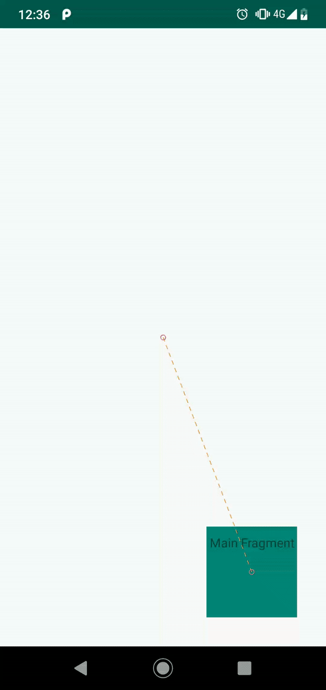

# Move my App with MotionLayout?

---

## Alexandre GENET

-  @AlexAlexandreG

-  xebia-france

-  alexandre7777/motion-layout-playground


---

# Warning XML Everywhere


---


---

# MotionLayout Beta 2

- Part of the **androidx.constraintlayout:constraintlayout:2.0.0-beta2**

---


---

# Code Time


---

```xml 
<MotionScene
        xmlns:android="http://schemas.android.com/apk/res/android"
        xmlns:motion="http://schemas.android.com/apk/res-auto">

    <Transition
            motion:constraintSetStart="@id/start"
            motion:constraintSetEnd="@id/end"
            motion:duration="1000">
        <OnSwipe
                motion:touchAnchorId="@+id/android_img"
                motion:touchAnchorSide="right"
                motion:dragDirection="dragRight"/>
    </Transition>

    <ConstraintSet
            android:id="@+id/start">
        <Constraint
                android:id="@+id/android_img"
                android:layout_width="100dp"
                android:layout_height="100dp"
                android:layout_marginStart="8dp"
                motion:layout_constraintBottom_toBottomOf="parent"
                motion:layout_constraintStart_toStartOf="parent"
                motion:layout_constraintTop_toTopOf="parent">
        </Constraint>
    </ConstraintSet>
    <ConstraintSet android:id="@+id/end">
        <Constraint
                android:id="@id/android_img"
                android:layout_width="100dp"
                android:layout_height="100dp"
                android:layout_marginEnd="8dp"
                motion:layout_constraintBottom_toBottomOf="parent"
                motion:layout_constraintEnd_toEndOf="parent"
                motion:layout_constraintTop_toTopOf="parent">
        </Constraint>
    </ConstraintSet>
</MotionScene>
```


---

```xml 
<MotionScene ...>
    <Transition
            motion:constraintSetStart="@id/start"
            motion:constraintSetEnd="@id/end" ...>
        <OnSwipe ... />
    </Transition>

    <ConstraintSet
            android:id="@+id/start">
        <Constraint
                android:id="@+id/android_img"
                motion:layout_constraintStart_toStartOf="parent"
                ...>
        </Constraint>
    </ConstraintSet>
    <ConstraintSet android:id="@+id/end">
        <Constraint
                android:id="@id/android_img"
                motion:layout_constraintEnd_toEndOf="parent"
                ...>
        </Constraint>
    </ConstraintSet>
</MotionScene>
```


---

[.code-highlight: 12-13, 21-22]

```xml 
<MotionScene ...>
    <Transition
            motion:constraintSetStart="@id/start"
            motion:constraintSetEnd="@id/end" ...>
        <OnSwipe ... />
    </Transition>

    <ConstraintSet
            android:id="@+id/start">
        <Constraint
                android:id="@+id/android_img"
                android:layout_width="100dp"
                android:layout_height="100dp"
                motion:layout_constraintStart_toStartOf="parent"
                ...>
        </Constraint>
    </ConstraintSet>
    <ConstraintSet android:id="@+id/end">
        <Constraint
                android:id="@id/android_img"
                android:layout_width="200dp"
                android:layout_height="200dp"
                motion:layout_constraintEnd_toEndOf="parent"
                ...>
        </Constraint>
    </ConstraintSet>
</MotionScene>
```


---

[.code-highlight: 6-12]

```xml 
<MotionScene ...>
    <Transition
            motion:constraintSetStart="@id/start"
            motion:constraintSetEnd="@id/end" ...>
        <OnSwipe ... />
        <KeyFrameSet>
            <KeyPosition
                    motion:keyPositionType="parentRelative"
                    motion:percentY="0.25"
                    motion:framePosition="50"
                    motion:motionTarget="@+id/android_img"/>
        </KeyFrameSet>
    </Transition>

    <ConstraintSet
            android:id="@+id/start">
        <Constraint
                android:id="@+id/android_img"
                motion:layout_constraintStart_toStartOf="parent"
                ...>
        </Constraint>
    </ConstraintSet>
    <ConstraintSet android:id="@+id/end">
        <Constraint
                android:id="@id/android_img"
                motion:layout_constraintEnd_toEndOf="parent"
                ...>
        </Constraint>
    </ConstraintSet>
</MotionScene>
```


---

[.code-highlight: 6-12]

```xml 
<MotionScene ...>
    <Transition
            motion:constraintSetStart="@id/start"
            motion:constraintSetEnd="@id/end" ...>
        <OnSwipe ... />
        <KeyFrameSet>
            <KeyAttribute
                    android:scaleX="2"
                    android:scaleY="2"
                    motion:framePosition="50"
                    motion:motionTarget="@id/android_img"/>
        </KeyFrameSet>
    </Transition>

    <ConstraintSet
            android:id="@+id/start">
        <Constraint
                android:id="@+id/android_img"
                motion:layout_constraintStart_toStartOf="parent"
                ...>
        </Constraint>
    </ConstraintSet>
    <ConstraintSet android:id="@+id/end">
        <Constraint
                android:id="@id/android_img"
                motion:layout_constraintEnd_toEndOf="parent"
                ...>
        </Constraint>
    </ConstraintSet>
</MotionScene>
```


---

[.code-highlight: 6-11]

```xml 
<MotionScene ...>
    <Transition
            motion:constraintSetStart="@id/start"
            motion:constraintSetEnd="@id/end" ...>
        <OnSwipe ... />
        <KeyFrameSet>
            <KeyAttribute
                    android:rotation="-45"
                    motion:framePosition="50"
                    motion:motionTarget="@id/android_img"/>
        </KeyFrameSet>
    </Transition>

    <ConstraintSet
            android:id="@+id/start">
        <Constraint
                android:id="@+id/android_img"
                motion:layout_constraintStart_toStartOf="parent"
                ...>
        </Constraint>
    </ConstraintSet>
    <ConstraintSet android:id="@+id/end">
        <Constraint
                android:id="@id/android_img"
                motion:layout_constraintEnd_toEndOf="parent"
                ...>
        </Constraint>
    </ConstraintSet>
</MotionScene>
```


---

[.code-highlight: 14-16, 24-26]

```xml 
<MotionScene ...>
    <Transition
            motion:constraintSetStart="@id/start"
            motion:constraintSetEnd="@id/end" ...>
        <OnSwipe ... />
    </Transition>

    <ConstraintSet
            android:id="@+id/start">
        <Constraint
                android:id="@+id/android_img"
                motion:layout_constraintStart_toStartOf="parent"
                ...>
            <CustomAttribute
                    motion:attributeName="backgroundColor"
                    motion:customColorValue="@color/brown"/>
        </Constraint>
    </ConstraintSet>
    <ConstraintSet android:id="@+id/end">
        <Constraint
                android:id="@id/android_img"
                motion:layout_constraintEnd_toEndOf="parent"
                ...>
            <CustomAttribute
                    motion:attributeName="backgroundColor"
                    motion:customColorValue="@color/green"/>
        </Constraint>
    </ConstraintSet>
</MotionScene>
```


---

[.code-highlight: 12, 18-19]

```xml 
<?xml version="1.0" encoding="utf-8"?>
<androidx.constraintlayout.motion.widget.MotionLayout
        xmlns:android="http://schemas.android.com/apk/res/android"
        xmlns:app="http://schemas.android.com/apk/res-auto"
        xmlns:tools="http://schemas.android.com/tools"
        android:layout_width="match_parent"
        android:layout_height="match_parent"
        tools:context=".ui.androidversionlist.AndroidVersionListActivity"
        app:layoutDescription="@xml/scene_jellybean"
        app:showPaths="true">

    <androidx.constraintlayout.utils.widget.ImageFilterView
            android:id="@+id/android_img"
            android:layout_width="100dp"
            android:layout_height="100dp"
            android:layout_marginStart="8dp"
            android:layout_marginTop="8dp"
            android:src="@drawable/jelly_bean"
            app:altSrc="@drawable/kitkat"
            app:layout_constraintStart_toStartOf="parent"
            app:layout_constraintTop_toTopOf="parent"
            android:contentDescription="@string/android_jellybean"/>

</androidx.constraintlayout.motion.widget.MotionLayout>
```


---

[.code-highlight: 14-16, 24-26]

```xml 
<MotionScene ...>
    <Transition
            motion:constraintSetStart="@id/start"
            motion:constraintSetEnd="@id/end" ...>
        <OnSwipe ... />
    </Transition>

    <ConstraintSet
            android:id="@+id/start">
        <Constraint
                android:id="@+id/android_img"
                motion:layout_constraintStart_toStartOf="parent"
                ...>
            <CustomAttribute
                    motion:attributeName="crossfade"
                    motion:customFloatValue="0"/>
        </Constraint>
    </ConstraintSet>
    <ConstraintSet android:id="@+id/end">
        <Constraint
                android:id="@id/android_img"
                motion:layout_constraintEnd_toEndOf="parent"
                ...>
            <CustomAttribute
                    motion:attributeName="crossfade"
                    motion:customFloatValue="1"/>
        </Constraint>
    </ConstraintSet>
</MotionScene>
```


---

[.code-highlight: 14-16, 24-26]

```xml 
<MotionScene ...>
    <Transition
            motion:constraintSetStart="@id/start"
            motion:constraintSetEnd="@id/end" ...>
        <OnSwipe ... />
    </Transition>

    <ConstraintSet
            android:id="@+id/start">
        <Constraint
                android:id="@+id/android_img"
                motion:layout_constraintStart_toStartOf="parent"
                ...>
            <CustomAttribute
                    motion:attributeName="saturation"
                    motion:customFloatValue="0"/>
    </ConstraintSet>
    <ConstraintSet android:id="@+id/end">
        <Constraint
                android:id="@id/android_img"
                motion:layout_constraintEnd_toEndOf="parent"
                ...>
            <CustomAttribute
                    motion:attributeName="saturation"
                    motion:customFloatValue="1"/>
        </Constraint>
    </ConstraintSet>
</MotionScene>
```


---

[.code-highlight: 9-10, 12, 15-16, 18, 21-22, 24, 33]

```xml 
<MotionScene ...>
    <Transition
            motion:constraintSetStart="@id/start"
            motion:constraintSetEnd="@id/end" ...>
        <OnSwipe ... />
	<KeyFrameSet>
            <KeyPosition
                    motion:keyPositionType="parentRelative"
                    motion:percentY="0.1"
                    motion:framePosition="25"
                    motion:motionTarget="@+id/android_img"
                    motion:pathMotionArc="startVertical"/>
            <KeyPosition
                    motion:keyPositionType="parentRelative"
                    motion:percentY="0.5"
                    motion:framePosition="50"
                    motion:motionTarget="@+id/android_img"
                    motion:pathMotionArc="startHorizontal"/>
            <KeyPosition
                    motion:keyPositionType="parentRelative"
                    motion:percentY="0.1"
                    motion:framePosition="75"
                    motion:motionTarget="@+id/android_img"
                    motion:pathMotionArc="startVertical"/>
        </KeyFrameSet>
    </Transition>

    <ConstraintSet
            android:id="@+id/start">
        <Constraint
                android:id="@+id/android_img"
                motion:layout_constraintStart_toStartOf="parent"
                motion:pathMotionArc="startHorizontal"
                ...>
    </ConstraintSet>
    <ConstraintSet android:id="@+id/end">
        <Constraint
                android:id="@id/android_img"
                motion:layout_constraintEnd_toEndOf="parent"
                ...>
        </Constraint>
    </ConstraintSet>
</MotionScene>
```


---

# Coordinator, ViewPager and Drawer

---


---

[.code-highlight: 1, 5, 12-13, 20-21]

```xml
<com.alexandre.motionlayoutplayground.ui.motionutils.CollapsibleToolbar
        xmlns:android="http://schemas.android.com/apk/res/android"
        xmlns:app="http://schemas.android.com/apk/res-auto"
        android:id="@+id/motionLayout"
        app:layoutDescription="@xml/scene_marshmallow"
        android:layout_width="match_parent"
        android:layout_height="match_parent"
        android:minHeight="50dp"
        android:fitsSystemWindows="false"
        app:layout_scrollFlags="scroll|enterAlways|snap|exitUntilCollapsed">

    <ImageView
            android:id="@+id/background"
            android:layout_width="match_parent"
            android:layout_height="200dp"
            android:scaleType="centerCrop"
            android:src="@drawable/marshmallow_background"
            android:contentDescription="@string/android_marshmallow"/>

    <ImageView
            android:id="@+id/droid"
            android:layout_width="50dp"
            android:layout_height="50dp"
            android:scaleType="fitCenter"
            android:src="@drawable/marshmallow_droid"
            android:contentDescription="@string/droid"/>

</com.alexandre.motionlayoutplayground.ui.motionutils.CollapsibleToolbar>
```


---

[.code-highlight: 1, 3, 5-6]

```kotlin
class CollapsibleToolbar @JvmOverloads constructor(
    context: Context, attrs: AttributeSet? = null, defStyleAttr: Int = 0
) : MotionLayout(context, attrs, defStyleAttr), AppBarLayout.OnOffsetChangedListener {

    override fun onOffsetChanged(appBarLayout: AppBarLayout?, verticalOffset: Int) {
        progress = -verticalOffset / (appBarLayout?.totalScrollRange?.toFloat() ?: 0F)
    }

    override fun onAttachedToWindow() {
        super.onAttachedToWindow()
        (parent as? AppBarLayout)?.addOnOffsetChangedListener(this)
    }
}
```


---

[.code-highlight: 20-21, 32]

```xml
<MotionScene
        xmlns:android="http://schemas.android.com/apk/res/android"
        xmlns:motion="http://schemas.android.com/apk/res-auto">

    <Transition
            motion:constraintSetStart="@id/start"
            motion:constraintSetEnd="@id/end"
            motion:duration="1000">
    </Transition>

    <ConstraintSet
            android:id="@+id/start">
        <Constraint
                android:id="@+id/droid"
                android:layout_width="50dp"
                android:layout_height="50dp"
                android:layout_marginStart="8dp"
                android:layout_marginBottom="24dp"
                motion:layout_constraintBottom_toBottomOf="parent"
                motion:layout_constraintStart_toStartOf="parent"
                motion:layout_constraintEnd_toEndOf="parent">
        </Constraint>
    </ConstraintSet>
    <ConstraintSet android:id="@+id/end">
        <Constraint
                android:id="@id/droid"
                android:layout_width="50dp"
                android:layout_height="50dp"
                android:layout_marginEnd="8dp"
                android:layout_marginBottom="24dp"
                motion:layout_constraintBottom_toBottomOf="parent"
                motion:layout_constraintEnd_toStartOf="parent">
        </Constraint>
    </ConstraintSet>
</MotionScene>
```


---

[.code-highlight: 1, 5, 9-10, 14-15]

```xml
<com.alexandre.motionlayoutplayground.ui.motionutils.ViewpagerHeader
        xmlns:android="http://schemas.android.com/apk/res/android"
        xmlns:app="http://schemas.android.com/apk/res-auto"
        android:id="@+id/motionLayout"
        app:layoutDescription="@xml/scene_nougat"
        android:layout_width="match_parent"
        android:layout_height="230dp">

    <View
            android:id="@+id/backgroundView"
            android:layout_width="match_parent"
            android:layout_height="match_parent"/>

    <ImageView
            android:id="@+id/droid"
            android:layout_width="wrap_content"
            android:layout_height="wrap_content"
            android:scaleType="centerCrop"
            android:src="@drawable/nougat"
            android:contentDescription="@null"/>

</com.alexandre.motionlayoutplayground.ui.motionutils.ViewpagerHeader>
```


---

[.code-highlight: 1, 3, 8-10]

```kotlin
class ViewpagerHeader @JvmOverloads constructor(
    context: Context, attrs: AttributeSet? = null, defStyleAttr: Int = 0
) : MotionLayout(context, attrs, defStyleAttr), ViewPager.OnPageChangeListener {

    override fun onPageScrollStateChanged(state: Int) {
    }

    override fun onPageScrolled(position: Int, positionOffset: Float, positionOffsetPixels: Int) {
        val numPages = 3
        progress = (position + positionOffset) / (numPages - 1)
    }

    override fun onPageSelected(position: Int) {
    }
}
```


---

```xml
<MotionScene
	...>

    <Transition
            motion:constraintSetStart="@id/start"
            motion:constraintSetEnd="@id/end"
            ...>

        <!-- Middle page -->
        <!-- ... -->
        

    </Transition>

    <!-- First page -->
    <ConstraintSet
            android:id="@+id/start">
        <Constraint
                android:id="@+id/droid"
                motion:layout_constraintLeft_toLeftOf="parent"
                ...>
        </Constraint>
        <Constraint
                android:id="@+id/backgroundView">
            <CustomAttribute
                    motion:attributeName="backgroundColor"
                    motion:customColorValue="@android:color/white"/>
        </Constraint>
    </ConstraintSet>
    <!-- Last page -->
    <!-- ... -->
</MotionScene>
```


---

```xml
<MotionScene
	...>

    <Transition
            motion:constraintSetStart="@id/start"
            motion:constraintSetEnd="@id/end"
            ...>

        <!-- Middle page -->
        <KeyFrameSet>
            <KeyPosition
                    motion:keyPositionType="parentRelative"
                    motion:percentY="0.5"
                    motion:framePosition="50"
                    motion:motionTarget="@+id/droid">
                <KeyAttribute
                        motion:framePosition="50"
                        motion:motionTarget="@id/backgroundView">
                    <CustomAttribute
                            motion:attributeName="backgroundColor"
                            motion:customColorValue="@color/green"/>
                </KeyAttribute>
            </KeyPosition>
        </KeyFrameSet>

    </Transition>

    <!-- First page -->
    <!-- ... -->
    
    <!-- Last page -->
    <!-- ... -->
</MotionScene>
```


---

```xml
<MotionScene
	...>

    <Transition
            motion:constraintSetStart="@id/start"
            motion:constraintSetEnd="@id/end"
            ...>

        <!-- Middle page -->
        <!-- ... -->

    </Transition>

    <!-- First page -->
    <!-- ... -->

    <!-- Last page -->
    <ConstraintSet android:id="@+id/end">
        <Constraint
                android:id="@id/droid"
                motion:layout_constraintRight_toRightOf="parent"
                ...>
        </Constraint>
        <Constraint
                android:id="@+id/backgroundView">
            <CustomAttribute
                    motion:attributeName="backgroundColor"
                    motion:customColorValue="@color/brown"/>
        </Constraint>
    </ConstraintSet>
</MotionScene>
```


---

[.code-highlight: 1, 8, 10-12, 24-25, 35-36]

```xml
<com.alexandre.motionlayoutplayground.ui.motionutils.DrawerContent
        xmlns:android="http://schemas.android.com/apk/res/android"
        xmlns:app="http://schemas.android.com/apk/res-auto"
        android:id="@+id/menu"
        android:layout_width="180dp"
        android:layout_height="match_parent"
        android:layout_gravity="start"
        app:layoutDescription="@xml/scene_oreo"
        android:background="#FFF">

    <TextView
            android:id="@+id/textViewDonut"
            android:layout_width="0dp"
            android:layout_height="wrap_content"
            android:layout_marginEnd="8dp"
            android:layout_marginStart="8dp"
            android:layout_marginTop="32dp"
            android:text="@string/android_donut"
            android:textColor="#000"
            app:layout_constraintEnd_toStartOf="@+id/imageViewDonut"
            app:layout_constraintStart_toStartOf="parent"
            app:layout_constraintTop_toTopOf="parent"/>

    <ImageView
            android:id="@+id/imageViewDonut"
            android:layout_width="50dp"
            android:layout_height="50dp"
            android:layout_marginEnd="8dp"
            android:contentDescription="@string/android_donut"
            android:src="@drawable/donut"
            app:layout_constraintBottom_toBottomOf="@+id/textViewDonut"
            app:layout_constraintEnd_toStartOf="@+id/viewDonut"
            app:layout_constraintTop_toTopOf="@+id/textViewDonut"/>

    <View
            android:id="@+id/viewDonut"
            android:layout_width="10dp"
            android:layout_height="10dp"
            android:layout_marginEnd="0dp"
            app:layout_constraintBottom_toBottomOf="@+id/imageViewDonut"
            app:layout_constraintEnd_toEndOf="parent"
            app:layout_constraintTop_toTopOf="@+id/imageViewDonut"/>

    <!-- ... -->

</com.alexandre.motionlayoutplayground.ui.motionutils.DrawerContent>
```


---

[.code-highlight: 1, 3, 7-8]

```kotlin
class DrawerContent @JvmOverloads constructor(
    context: Context, attrs: AttributeSet? = null, defStyleAttr: Int = 0
) : MotionLayout(context, attrs, defStyleAttr), DrawerLayout.DrawerListener {
    override fun onDrawerStateChanged(newState: Int) {
    }

    override fun onDrawerSlide(drawerView: View, slideOffset: Float) {
        progress = slideOffset
    }

    override fun onDrawerClosed(drawerView: View) {
    }

    override fun onDrawerOpened(drawerView: View) {
    }

    override fun onAttachedToWindow() {
        super.onAttachedToWindow()
        (parent as? DrawerLayout)?.addDrawerListener(this)
    }
}
```


---

```xml
<ConstraintSet android:id="@+id/start">
        <Constraint
                android:id="@+id/textViewDonut"
                android:layout_width="0dp"
                android:layout_height="wrap_content"
                android:layout_marginEnd="8dp"
                android:layout_marginStart="8dp"
                android:layout_marginTop="32dp"
                motion:layout_constraintEnd_toStartOf="@+id/imageViewDonut"
                motion:layout_constraintStart_toStartOf="parent"
                motion:layout_constraintTop_toTopOf="parent">
            <CustomAttribute
                    motion:attributeName="textColor"
                    motion:customColorValue="#000"/>
        </Constraint>

        <Constraint
                android:id="@+id/imageViewDonut"
                android:layout_width="50dp"
                android:layout_height="50dp"
                motion:layout_constraintBottom_toBottomOf="@+id/textViewDonut"
                motion:layout_constraintEnd_toStartOf="@+id/viewDonut"
                motion:layout_constraintTop_toTopOf="@+id/textViewDonut"/>

        <Constraint
                android:id="@+id/viewDonut"
                android:layout_width="10dp"
                android:layout_height="10dp"
                android:layout_marginEnd="0dp"
                motion:layout_constraintBottom_toBottomOf="@+id/imageViewDonut"
                motion:layout_constraintEnd_toEndOf="parent"
                motion:layout_constraintTop_toTopOf="@+id/imageViewDonut">
            <CustomAttribute
                    motion:attributeName="backgroundColor"
                    motion:customColorValue="#FFF"/>
        </Constraint>
</ConstraintSet>
```


---

```xml
<ConstraintSet android:id="@+id/end">
        <Constraint
                android:id="@+id/textViewDonut"
                android:layout_width="0dp"
                android:layout_height="wrap_content"
                android:layout_marginEnd="8dp"
                android:layout_marginStart="8dp"
                android:layout_marginTop="32dp"
                motion:layout_constraintEnd_toStartOf="@+id/imageViewDonut"
                motion:layout_constraintStart_toStartOf="parent"
                motion:layout_constraintTop_toTopOf="parent">
            <CustomAttribute
                    motion:attributeName="textColor"
                    motion:customColorValue="@color/donut"/>
        </Constraint>

        <Constraint
                android:id="@+id/imageViewDonut"
                android:layout_width="50dp"
                android:layout_height="50dp"
                android:rotation="360"
                motion:layout_constraintBottom_toBottomOf="@+id/textViewDonut"
                motion:layout_constraintEnd_toStartOf="@+id/viewDonut"
                motion:layout_constraintTop_toTopOf="@+id/textViewDonut"/>

        <Constraint
                android:id="@+id/viewDonut"
                android:layout_width="10dp"
                android:layout_height="50dp"
                android:layout_marginEnd="0dp"
                motion:layout_constraintBottom_toBottomOf="@+id/imageViewDonut"
                motion:layout_constraintEnd_toEndOf="parent"
                motion:layout_constraintTop_toTopOf="@+id/imageViewDonut">
            <CustomAttribute
                    motion:attributeName="backgroundColor"
                    motion:customColorValue="@color/donut"/>
        </Constraint>
</ConstraintSet>
```


---

```kotlin
motion.setTransitionListener(
object : MotionLayout.TransitionListener {

    override fun onTransitionStarted(motionLayout: MotionLayout?, startId: Int, endId: Int) {
        Toast.makeText(baseContext, "Start", Toast.LENGTH_SHORT).show()
    }

    override fun onTransitionChange(
        motionLayout: MotionLayout?,
        startId: Int,
        endId: Int,
        progress: Float
    ) {
        seekBar.progress = (progress * 100).toInt()
    }

    override fun onTransitionCompleted(motionLayout: MotionLayout?, currentId: Int) {
        Toast.makeText(baseContext, "Completed", Toast.LENGTH_SHORT).show()
    }

    override fun onTransitionTrigger(
        motionLayout: MotionLayout?,
        triggerId: Int,
        positive: Boolean,
        progress: Float
    ) {
    }
})
```


---

# KeyCycle

---

> Controls oscillations with respect to position of post layout properties during animation
-- developer.android.com

---

```xml
<MotionScene
        ...>

    <Transition
            ...>

        <KeyFrameSet>
            <KeyCycle
                    android:translationY="100dp"
                    motion:framePosition="100"
                    motion:motionTarget="@id/android_img"
                    motion:waveOffset="0"
                    motion:wavePeriod="0"
                    motion:waveShape="sin" />
            <KeyCycle
                    android:translationY="100dp"
                    motion:framePosition="50"
                    motion:motionTarget="@id/android_img"
                    motion:waveOffset="0"
                    motion:wavePeriod="1"
                    motion:waveShape="sin" />
            <KeyCycle
                    android:translationY="100dp"
                    motion:framePosition="0"
                    motion:motionTarget="@id/android_img"
                    motion:waveOffset="0"
                    motion:wavePeriod="0"
                    motion:waveShape="sin" />
        </KeyFrameSet>

    </Transition>
    <!-- ... -->
</MotionScene>
```


---
[.code-highlight: 9, 16, 23]

```xml
<MotionScene
        ...>

    <Transition
            ...>

        <KeyFrameSet>
            <KeyCycle
                    android:translationY="10dp"
                    motion:framePosition="100"
                    motion:motionTarget="@id/android_img"
                    motion:waveOffset="0"
                    motion:wavePeriod="0"
                    motion:waveShape="sin" />
            <KeyCycle
                    android:translationY="10dp"
                    motion:framePosition="50"
                    motion:motionTarget="@id/android_img"
                    motion:waveOffset="0"
                    motion:wavePeriod="1"
                    motion:waveShape="sin" />
            <KeyCycle
                    android:translationY="10dp"
                    motion:framePosition="0"
                    motion:motionTarget="@id/android_img"
                    motion:waveOffset="0"
                    motion:wavePeriod="0"
                    motion:waveShape="sin" />
        </KeyFrameSet>

    </Transition>
    <!-- ... -->
</MotionScene>
```


---
[.code-highlight: 17]

```xml
<MotionScene
        ...>

    <Transition
            ...>

        <KeyFrameSet>
            <KeyCycle
                    android:translationY="100dp"
                    motion:framePosition="100"
                    motion:motionTarget="@id/android_img"
                    motion:waveOffset="0"
                    motion:wavePeriod="0"
                    motion:waveShape="sin" />
            <KeyCycle
                    android:translationY="100dp"
                    motion:framePosition="99"
                    motion:motionTarget="@id/android_img"
                    motion:waveOffset="0"
                    motion:wavePeriod="1"
                    motion:waveShape="sin" />
            <KeyCycle
                    android:translationY="100dp"
                    motion:framePosition="0"
                    motion:motionTarget="@id/android_img"
                    motion:waveOffset="0"
                    motion:wavePeriod="0"
                    motion:waveShape="sin" />
        </KeyFrameSet>

    </Transition>
    <!-- ... -->
</MotionScene>
```


---
[.code-highlight: 17]

```xml
<MotionScene
        ...>

    <Transition
            ...>

        <KeyFrameSet>
            <KeyCycle
                    android:translationY="100dp"
                    motion:framePosition="100"
                    motion:motionTarget="@id/android_img"
                    motion:waveOffset="0"
                    motion:wavePeriod="0"
                    motion:waveShape="sin" />
            <KeyCycle
                    android:translationY="100dp"
                    motion:framePosition="1"
                    motion:motionTarget="@id/android_img"
                    motion:waveOffset="0"
                    motion:wavePeriod="1"
                    motion:waveShape="sin" />
            <KeyCycle
                    android:translationY="100dp"
                    motion:framePosition="0"
                    motion:motionTarget="@id/android_img"
                    motion:waveOffset="0"
                    motion:wavePeriod="0"
                    motion:waveShape="sin" />
        </KeyFrameSet>

    </Transition>
    <!-- ... -->
</MotionScene>
```


---
[.code-highlight: 14, 21, 28]

```xml
<MotionScene
        ...>

    <Transition
            ...>

        <KeyFrameSet>
            <KeyCycle
                    android:translationY="100dp"
                    motion:framePosition="100"
                    motion:motionTarget="@id/android_img"
                    motion:waveOffset="0"
                    motion:wavePeriod="0"
                    motion:waveShape="bounce" />
            <KeyCycle
                    android:translationY="100dp"
                    motion:framePosition="50"
                    motion:motionTarget="@id/android_img"
                    motion:waveOffset="0"
                    motion:wavePeriod="1"
                    motion:waveShape="bounce" />
            <KeyCycle
                    android:translationY="100dp"
                    motion:framePosition="0"
                    motion:motionTarget="@id/android_img"
                    motion:waveOffset="0"
                    motion:wavePeriod="0"
                    motion:waveShape="bounce" />
        </KeyFrameSet>

    </Transition>
    <!-- ... -->
</MotionScene>
```


---
[.code-highlight: 14, 20, 21, 28]

```xml
<MotionScene
        ...>

    <Transition
            ...>

        <KeyFrameSet>
            <KeyCycle
                    android:translationY="100dp"
                    motion:framePosition="100"
                    motion:motionTarget="@id/android_img"
                    motion:waveOffset="0"
                    motion:wavePeriod="0"
                    motion:waveShape="triangle" />
            <KeyCycle
                    android:translationY="100dp"
                    motion:framePosition="50"
                    motion:motionTarget="@id/android_img"
                    motion:waveOffset="0"
                    motion:wavePeriod="2"
                    motion:waveShape="triangle" />
            <KeyCycle
                    android:translationY="100dp"
                    motion:framePosition="0"
                    motion:motionTarget="@id/android_img"
                    motion:waveOffset="0"
                    motion:wavePeriod="0"
                    motion:waveShape="triangle" />
        </KeyFrameSet>

    </Transition>
    <!-- ... -->
</MotionScene>
```


---

```xml
<MotionScene
        ...>

    <Transition
            ...>

        <KeyFrameSet>
            <KeyCycle
                    android:translationY="-15dp"
                    motion:framePosition="100"
                    motion:motionTarget="@id/droid"
                    motion:waveOffset="0"
                    motion:wavePeriod="0"
                    motion:waveShape="bounce" />
            <KeyCycle
                    android:translationY="-15dp"
                    motion:framePosition="50"
                    motion:motionTarget="@id/droid"
                    motion:waveOffset="0"
                    motion:wavePeriod="5"
                    motion:waveShape="bounce" />
            <KeyCycle
                    android:translationY="-15dp"
                    motion:framePosition="0"
                    motion:motionTarget="@id/droid"
                    motion:waveOffset="0"
                    motion:wavePeriod="0"
                    motion:waveShape="bounce" />
        </KeyFrameSet>

    </Transition>
    <!-- ... -->
</MotionScene>
```


---

# Fragments

---

```xml
<androidx.constraintlayout.motion.widget.MotionLayout 
        xmlns:android="http://schemas.android.com/apk/res/android"
        xmlns:app="http://schemas.android.com/apk/res-auto"
        xmlns:tools="http://schemas.android.com/tools"
        android:id="@+id/motionLayout"
        android:layout_width="match_parent"
        android:layout_height="match_parent"
        android:orientation="vertical"
        app:layoutDescription="@xml/scene_example_fragment"
        app:showPaths="true"
        tools:context=".ui.detailandroid.FragmentExampleActivity">

    <FrameLayout
            android:id="@+id/container"
            android:layout_width="100dp"
            android:layout_height="100dp"
            android:layout_marginEnd="32dp"
            android:layout_marginBottom="32dp"
            app:layout_constraintBottom_toBottomOf="parent"
            app:layout_constraintEnd_toEndOf="parent" />

</androidx.constraintlayout.motion.widget.MotionLayout>
```



---

```xml
<MotionScene>
    <Transition
            motion:constraintSetEnd="@+id/end"
            motion:constraintSetStart="@+id/start">
        <KeyFrameSet>
            <KeyAttribute
                    android:scaleX="0.5"
                    android:scaleY="0.5"
                    motion:framePosition="50"
                    motion:motionTarget="@id/container" />
        </KeyFrameSet>
    </Transition>

    <OnSwipe
            motion:dragDirection="dragUp"
            motion:touchAnchorId="@+id/container"
            motion:touchAnchorSide="top" />

    <ConstraintSet android:id="@+id/start">

        <Constraint
                android:id="@+id/container"
                android:layout_width="100dp"
                android:layout_height="100dp"
                android:layout_marginEnd="32dp"
                android:layout_marginBottom="32dp"
                android:rotation="-360"
                motion:layout_constraintBottom_toBottomOf="parent"
                motion:layout_constraintEnd_toEndOf="parent">
            <CustomAttribute
                    motion:attributeName="BackgroundColor"
                    motion:customColorValue="@color/colorPrimary" />
        </Constraint>
    </ConstraintSet>

    <ConstraintSet android:id="@+id/end">

        <Constraint
                android:id="@id/container"
                android:layout_width="match_parent"
                android:layout_height="0dp"
                motion:layout_constraintBottom_toBottomOf="parent"
                motion:layout_constraintTop_toTopOf="parent">
            <CustomAttribute
                    motion:attributeName="BackgroundColor"
                    motion:customColorValue="@color/colorAccent" />
        </Constraint>
    </ConstraintSet>
</MotionScene>
```


---

```kotlin
class FragmentExampleActivity : AppCompatActivity(), MotionLayout.TransitionListener {

    private var lastProgress = 0f
    private var fragment: Fragment? = null

    override fun onTransitionTrigger(p0: MotionLayout?, p1: Int, p2: Boolean, progress: Float) {
    }

    override fun onTransitionStarted(p0: MotionLayout?, p1: Int, p2: Int) {
    }

    override fun onTransitionChange(p0: MotionLayout?, p1: Int, p2: Int, progress: Float) {
        if (progress - lastProgress > 0) {
            // from start to end
            val atEnd = Math.abs(progress - 1f) < 0.1f
            if (atEnd && fragment is MainFragment) {
                val transaction = supportFragmentManager.beginTransaction()

                fragment = DetailFragment().also {
                    transaction
                        .replace(R.id.container, it)
                        .commitNow()
                }
            }
        } else {
            // from end to start
            val atStart = progress < 0.9f
            if (atStart && fragment is DetailFragment) {
                val transaction = supportFragmentManager.beginTransaction()

                fragment = MainFragment().also {
                    transaction
                        .replace(R.id.container, it)
                        .commitNow()
                }
            }
        }
        lastProgress = progress
    }

    override fun onTransitionCompleted(p0: MotionLayout?, p1: Int) {
    }
    //...
}
```


---

```kotlin
class FragmentExampleActivity : AppCompatActivity(), MotionLayout.TransitionListener {

    //...
    override fun onCreate(savedInstanceState: Bundle?) {
        super.onCreate(savedInstanceState)
        setContentView(R.layout.activity_example_fragment)
        if (savedInstanceState == null) {
            fragment = MainFragment().also {
                supportFragmentManager.beginTransaction()
                    .replace(R.id.container, it)
                    .commitNow()
            }
        }
        motionLayout.setTransitionListener(this)
    }
}
```


---

# Click

---

[.code-highlight: 7, 8]
```xml
<MotionScene xmlns:android="http://schemas.android.com/apk/res/android"
        xmlns:motion="http://schemas.android.com/apk/res-auto">

    <Transition
            motion:constraintSetEnd="@id/end"
            motion:constraintSetStart="@id/start"
            motion:duration="1000"
            motion:motionInterpolator="bounce"/>

    <ConstraintSet android:id="@+id/start">
        <Constraint/>
    </ConstraintSet>
    <ConstraintSet android:id="@+id/end">
        <Constraint/>
    </ConstraintSet>
</MotionScene>
```


---

### motionInterpolator

- bounce
- easeInOut
- easeIn
- anticipate
- easeOut
- linear

---


```kotlin
class ButtonExampleActivity : AppCompatActivity() {

    private var start: Boolean = true

    override fun onCreate(savedInstanceState: Bundle?) {
        super.onCreate(savedInstanceState)
        setContentView(R.layout.activity_btn)

        android_img.setOnClickListener {
            if (start) {
                motion.transitionToEnd()
                start = false
            } else {
                motion.transitionToStart()
                start = true
            }
        }
    }
}
```


---


# Limitations

---


---


---


---


---

# Use it?

---

- **Medium** 
	- Introduction to MotionLayout (part I) [https://medium.com/google-developers/introduction-to-motionlayout-part-i-29208674b10d](https://medium.com/google-developers/introduction-to-motionlayout-part-i-29208674b10d)
	- Move my app with MotionLayout Part 2 [https://medium.com/xebia-france/move-my-app-with-motionlayout-part-2-12427f74bdaa
](https://medium.com/xebia-france/move-my-app-with-motionlayout-part-2-12427f74bdaa)

- **Codelab**
	- [https://developer.android.com/reference/android/support/constraint/motion/MotionLayout](https://developer.android.com/reference/android/support/constraint/motion/MotionLayout)

---

- **GitHub**
	- [https://github.com/googlesamples/android-ConstraintLayoutExamples](https://github.com/googlesamples/android-ConstraintLayoutExamples)
	- [https://github.com/alexandre7777/motion-layout-playground](https://github.com/alexandre7777/motion-layout-playground)

---

# Thanks!